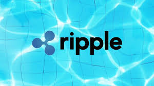

# Homework-Unit-1 test test

## Ripple a global payment systyem
* The company was founded in 2012 by Chris Larsen and Jed McCaleb. David Schwartz and Ryan Fugger were the main coders.
* The idea was concieved in 2004 to create a decentralized exchange that could empoyer local communites to create and trade their own money.
* Ripple has recieved angel funding from Google ventures, IDG capital, and Pantera capital. Ripple also recieved a Series A,B,C, from Santander International Bank. They roughly recieved 250 million dollars all together.
## Business Activites
* Ripple is trying to replace the old international money system (Swift) and replace it with blockchain and digital assets.
* Ripple's customers are international banks, MoneyGram, and Tech platforms that want to send global payments instantly and at a fraction of cost to anyone with a smartphone. Most of their competition isn't updating to blockchain because they are take insane fees from their customers. Ripple has a great first mover advantage.
* Ripple is using their own in house software called RippleNet which is a banking messaging system that is built on top of their own cryptocurrency XRP. The also have "On Demand Liquity" which is basically big amounts of currencies they sit on.
## Landscape
* Ripple is in the Global banking and International remittance space being very disruptive.
* Ripple is one of the biggest promoters of digital assests. They have help old institutions dip their toes into new tech.
* Ripple doesn't have much competition right now but IBM has partnered with Jed McCaleb (he had a falling out) and his Stellar blockchain. Other old institution are trying to create their own blockchains but many aren't getting off the ground.
## Results
* Ripple is having a huge explosion of growth. They have over 60 major partners. Their Xrp currency has gone from half a cent all the way up to ~20 cents. 
Even though they are a private company they show annual revenue reports to prove how healthy the company is. There is also rumors that the company might go public. Having Ripple in the stock market will definetly be a metric that they have made it.  
* Ripple is currently valued at 10 billion. Ripple says it now has over 300 financial services customers globally.
## Recommendations
* Ripple is a great Fintech company and I have no business giving suggestions on the Tech or Financial side.
* Ripple does have a few lawsuits pending because the premined Xrp given out could be considered an unregisterd security.
* My recommendations would be to settle these lawsuits as soon as possible, make peace with the SEC ,civilian plantiffs,etc and go public! $$$

Sources:  
ripple.com  
[Cnbc](https://www.cnbc.com/2019/12/20/ripple-creator-of-xrp-crypotocurrency-is-now-valued-at-10-billion.html)  
[Coindesk](https://www.coindesk.com/ripple-files-last-bid-to-dismiss-xrp-securities-lawsuit-before-court-meeting)  
[Wiki](https://en.wikipedia.org/wiki/Ripple_(payment_protocol))
